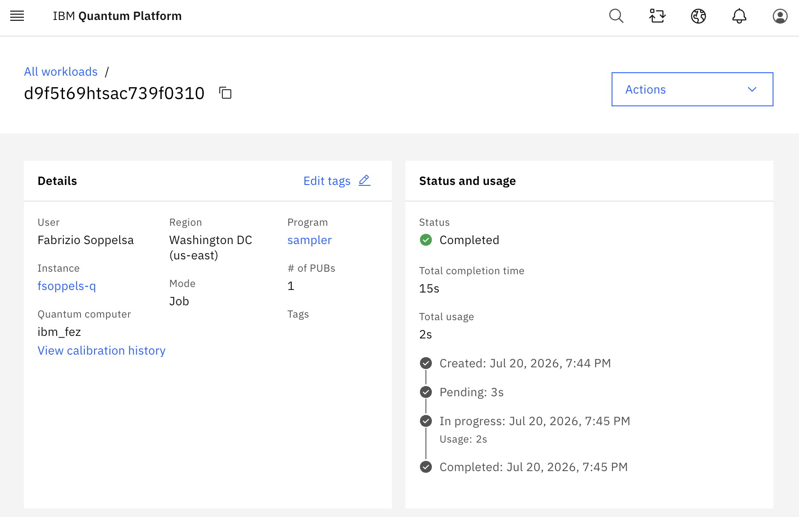
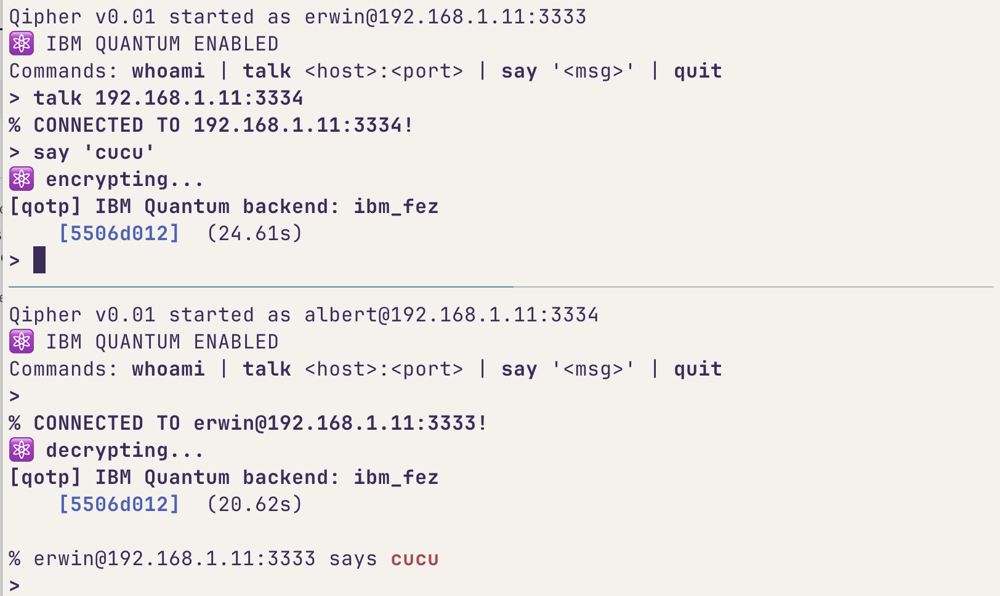

# qipher

A quantum one-time pad (QOTP) chat toy, runs on real IBM Quantum hardware.

## Quantum Vernam

Each plaintext byte is encoded into 8 qubits, $|0\rangle$ or $|1\rangle$. 

Alice encrypts applying a random Pauli mask per qubit, using 2 key bits $(k_1, k_2)$:

$$E_{k_1,k_2}(\rho) = X^{k_1} Z^{k_2}\, \rho\, Z^{k_2} X^{k_1}$$

Bob decrypts applying the inverse and in reverse order:

$$D_{k_1,k_2}(\rho) = Z^{k_2} X^{k_1}\, \rho\, X^{k_1} Z^{k_2}$$

Since $X^2 = Z^2 = I$, $D_{k_1,k_2} \circ E_{k_1,k_2} = I$: applying the same key twice recovers $\rho$ exactly. With $(k_1,k_2)$ uniform and secret, the encrypted state is maximally mixed to Eve like a quantum analogue of the classical Vernam.
For an $n$-bit message, the key is $2n$ bits, one $(k_1,k_2)$ pair per qubit, never reused.

## Key: symmetric, fixed, no exchange

The key is a fixed, hardcoded symmetric key (`vernam.py`) shared
by both peers from the beginning.

There is no BB84, no QKD, and no key-exchange protocol, this is intentionally out of scope.

## Hardware

Circuits run on IBM Quantum backends (e.g. `ibm_marrakesh` or `ibm_fez`) via Qiskit Runtime. A single encrypt op completes in real ~2s of total QPU usage:

Two peers exchanging an encrypted message end-to-end (**erwin** encrypts, **albert** decrypts), each round-tripping through `ibm_fez`:

